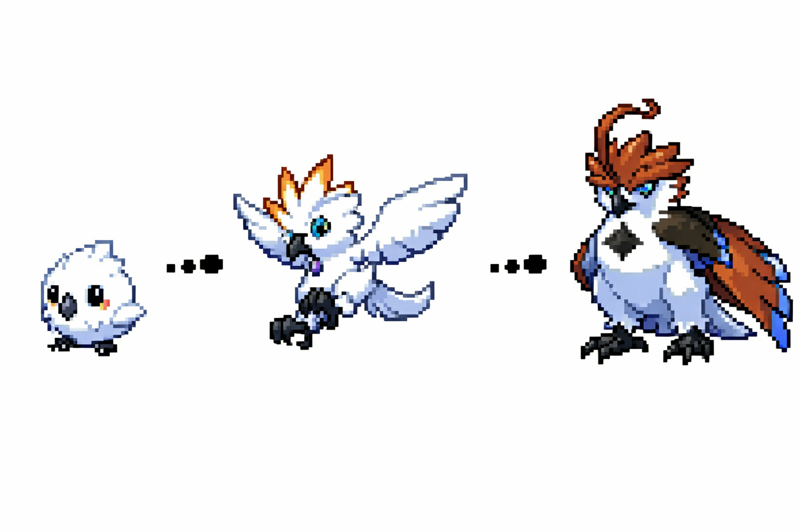

# Mythtales

A 2D browser-based Survival RPG Monster-tamer game.

This project will focus on building a game from scratch using only HTML and Vanilla JavaScript. 

  

---

## Main Features

- Survival Game Mechanics (such as: Farming, Building, Eating).
- Turn-based monster vs. monster combat system.
- Role-playing Game (RPG)

---

## Development Roadmap
Current Roadmap:
- Player movement system
- Collision detection, Map boundaries
- Add NPC and NPC interaction
- Implement turn-based Battle system
- Sound effects and background music audio integration

Future Roadmap:
- Survival Game Mechanics
- Player Combat System
- Open-world Map
- 150+ different and unique tamable monsters.

---

## Snapshots:

Coming soon...

---

